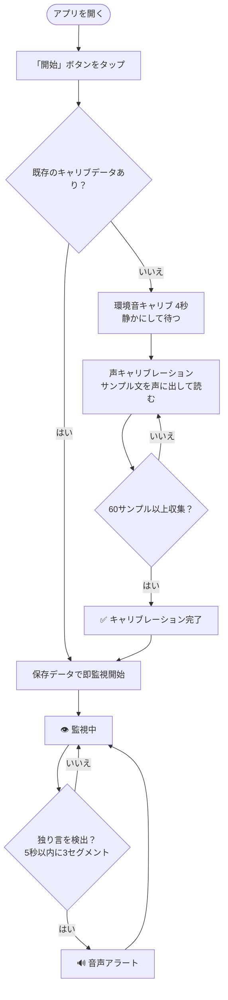
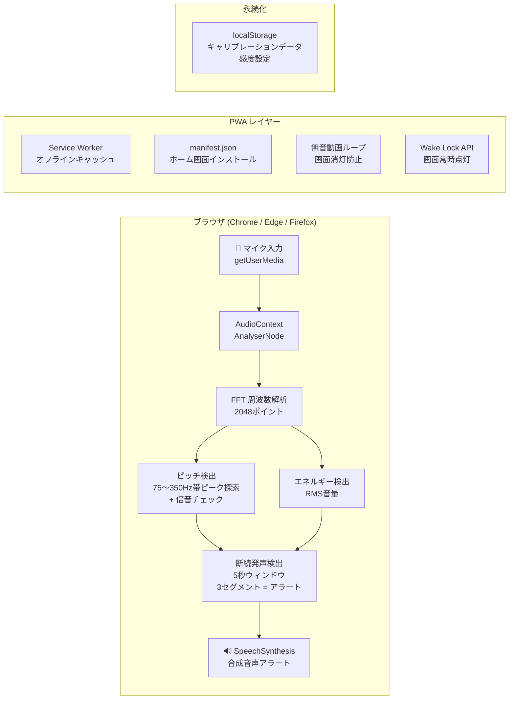
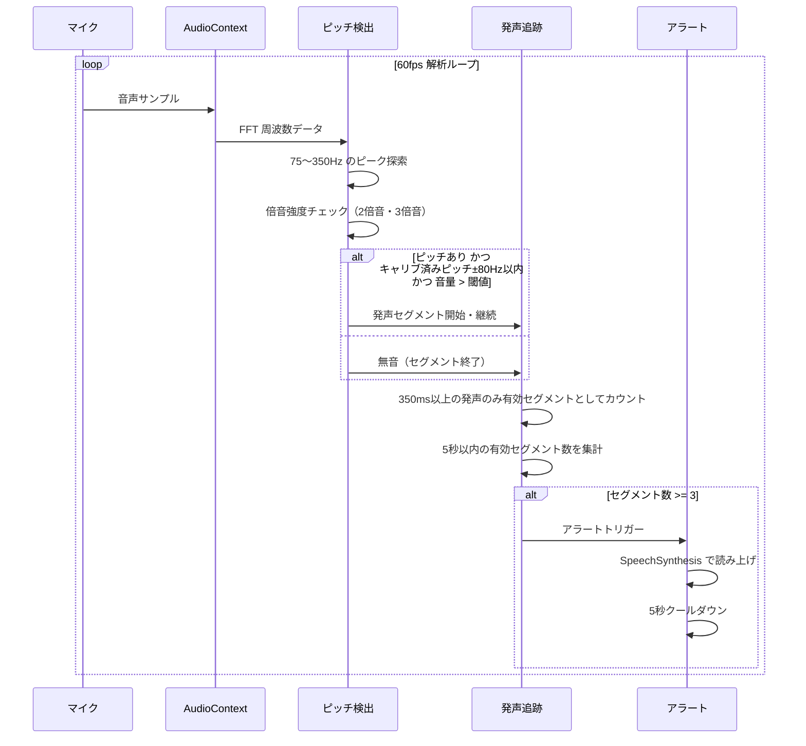

# 独り言チェッカー

**スマホを置くだけで、独り言を検出して音声アラートを鳴らす PWA アプリ**

[](https://yusaka0815.github.io/hitorigoto-checker/)
[](https://github.com/yusaka0815/hitorigoto-checker/releases)
[](LICENSE)

---

## デモ

**→ [https://yusaka0815.github.io/hitorigoto-checker/](https://yusaka0815.github.io/hitorigoto-checker/)**

Android スマホのブラウザで開き、ホーム画面に追加するとアプリとして常駐できます。

---

## 概要

作業中・テレワーク中など「独り言を言わないようにしたい」場面で使えるツールです。
マイクで音声を常時監視し、あなたの声のピッチを学習。独り言を検出すると合成音声でアラートします。

```
部屋に置いたスマホ → マイク常時監視 → 独り言を検出 → 「独り言に注意してください」と読み上げ
```

---

## 機能

| 機能 | 説明 |
|------|------|
| 環境音キャリブレーション | 部屋の騒音レベルを自動計測し、音声検出の基準ノイズフロアを設定 |
| 声キャリブレーション | サンプル文を読み上げてもらい、あなたの声のピッチを学習 |
| ピッチ検出 | FFT 周波数解析 + 倍音チェックで人の声を精度よく識別 |
| 断続発声検出 | 5 秒のウィンドウ内で 3 セグメント以上の発声でアラート（咳・短音を除外） |
| 合成音声アラート | SpeechSynthesis API で日本語読み上げ（非対応時はビープ音） |
| 感度調整 | 7 段階スライダーで誤検知と検出感度をチューニング |
| 画面消灯防止 | Wake Lock API + 無音動画ループの二重対策（MDM 環境対応） |
| PWA 対応 | ホーム画面インストール・オフライン動作 |
| 設定保存 | キャリブレーション結果を localStorage に自動保存 |

---

## 使い方



### キャリブレーション時のサンプル文

> 「今日もよろしくお願いします。ちょっと待って。なるほどね。」

---

## 技術アーキテクチャ



### 検出アルゴリズム



---

## ファイル構成

```
hitorigoto-checker/
├── index.html      # アプリ本体（HTML + CSS + JS の単一ファイル）
├── manifest.json   # PWA マニフェスト
├── sw.js           # Service Worker（オフライン対応・ネットワーク優先）
└── icon.svg        # アプリアイコン
```

> すべて静的ファイルのため、GitHub Pages でそのまま公開できます。サーバーサイド処理は不要です。

---

## インストール（PWA）

### Android（Chrome）

1. ブラウザでアプリ URL を開く
2. 画面下部に表示される「ホーム画面に追加できます」バナーをタップ
3. または Chrome メニュー →「ホーム画面に追加」

### iOS（Safari）

1. Safari でアプリ URL を開く
2. 共有ボタン → 「ホーム画面に追加」

---

## 動作環境

- **推奨**: Android Chrome / Edge（Wake Lock API 対応）
- **iOS Safari**: 動作するが、一部機能に制限あり
- マイクへのアクセス許可が必要です
- **HTTPS 必須**（GitHub Pages は対応済み）

---

## ローカル開発

```bash
# リポジトリをクローン
git clone https://github.com/yusaka0815/hitorigoto-checker.git
cd hitorigoto-checker

# ローカルサーバーで起動（HTTPS が必要なため）
npx serve .
# または
python -m http.server 8080
```

> マイク API は HTTP では動作しません（localhost は例外）。
> 本番デプロイは `main` ブランチへの push で GitHub Pages が自動更新されます。

---

## バージョン履歴

| バージョン | 変更内容 |
|-----------|---------|
| v1.6.5 | ビープ音を合成音声アラートに変更 |
| v1.6.4 | 無音動画ループで MDM 環境の画面消灯を防止 |
| v1.6.3 | ピッチ閾値・倍音強度・最小セグメント時間を調整 |
| v1.6.2 | PWA インストールバナー追加 |
| v1.6.1 | キャリブレーションのサンプル数増加・完了演出・品質判定修正 |
| v1.6.0 | 声キャリブレーションをサンプル数ベースの自動完了に変更 |
| v1.5.x | PWA 対応・Service Worker・全画面レイアウト |
| v1.4.x | Wake Lock・デバッグ非表示・キャリブ結果の言語表示 |
| v1.3.x | ピッチ検出・倍音チェック・断続発声の累計検出 |
| v1.2.x | 声キャリブレーション・localStorage 保存・感度スライダー |

---

## ライセンス

MIT License
